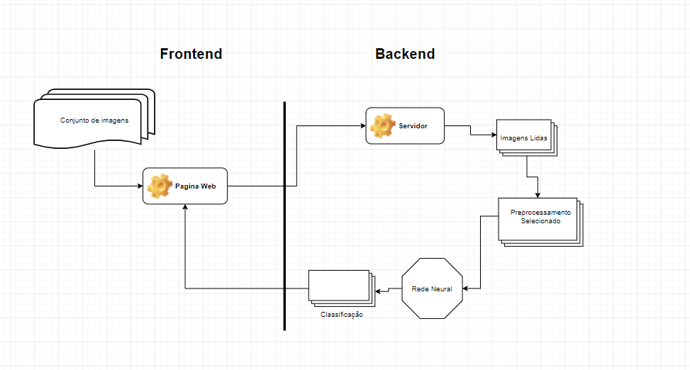

# Trabalho Final de FSI

Universidade de Brasília

Departamento de Ciência da Computação

CIC0193 - Fundamentos de Sistemas Inteligentes - 2021/1

Alunos: Gabriel Oliveira & Thiago Chaves

Professor: Vinícius R. P. Borges

## Sumário

O sistema web criado tem como propósito criar uma forma de pessoas descobrirem se seus desenhos são "furries" ou não.
Para a criação do sistema foram utilizadas as bibliotecas de python: Keras para o reconhecimento das imagens, Numpy para calculos e Flask para criação da API. 

O sistema pode ser encontrado no endereço: LINK

A seguir serão descritos o funcionamento do sistema, a metodologia empregada e os resultados obtidos.

## Casos de Uso

O sistema recebe como entrada um arquivo comprimido .zip contendo todas as imagens que o usuário quer que sejam avaliadas por ele. Em seguida o usuário deve clicar no botão confirmar para que os dados sejam enviados para o nosso servidor backend que será feito o processamento. Após um tempo de espera será disponibilizado na mesma pagina os resultados de cada imagem do arquivo zip que mostrarão o quão Furry o desenho enviado é.

## Metodologia

- Inicialmente a pagina web recebe um conjunto de imagens a serem processadas
- Em seguida as imagens são enviadas ao servidor
- As imagens são lidas e é realizado o preprocessamento que foi selecionado
- Os dados são enviados a uma rede neural convolucional
- O resultado da rede neural é uma porcentagem relacionada ao quão furry sua imagem é
- Esse resultado é enviado de volta a página web onde é mostrada para o usuário.

## Dataset 

Foi usado como referencia dois datasets distintos. A seguir estão referenciados o link de seus respectivos repositórios:

- Dataset de imagens de cartoon: [iCartoon](https://github.com/luxiangju-PersonAI/iCartoonFace) 
- Dataset de desenhos antropomorficos: [E621 Faces Dataset](https://github.com/arfafax/E621-Face-Dataset).

As imagens usadas para o treinamento da rede convolucional podem ser encontradas:  [Google Drive](https://goggle) 
## Resultados experimentais

Para os casos de teste foram usados um conjunto separado do conjunto de treinamento, com 100 imagens de desenhos e 37 de furries. Como os rotulos são binários e o resultado dos modelos criados são um número real, os valores acima de 0.5 foram considerados como 1, e abaixo de 0.5 como 0.

Todos os modelos criados foram treinados por 10 epochs. 

### Teste inicial

Os testes foram inicialmente feitos usando um minimo de preprocessamento para ver como o modelo proposto se sairia nos testes. O modelo criado é referenciado no sistema como "CNN - Resizing Without preprocessing", em que todas as imagens usadas na rede convolucional são apenas redimensionadas para um tamanho de 512x512. 

Nesse teste, obtivemos uma acurácia de 80% para os casos de teste. Porém, a topologia da rede, dado o tamanho inicial da imagem possuia muitos parametros de treinamento, o que tornou o processo de aprendizagem e classificação muito demorado. 

### Testes com preprocessamento

A seguir foram feitos uma série de mudanças no preprocessamento das imagens e na topologia da CNN. Foram tirados algumas camadas densas e de convolução em relação a original e o preprocessamento dos dados foi mudado para um redimensionamento de 64x64 e uso de tons de cinza. Esse modelo é referenciado no sistema como "CNN - Gray Scale/ Resize 64x64".

Nesse teste, foram obtidos resultados melhores que no anterior, com uma acuraciad e 91% para os casos de teste. Com essa nova topologia, a fase de treinamento se mostrou consideravelmente mais rapida, assim como a classificação do conjunto de testes.

Além disso, no teste seguinte, foi adicionada uma fase de rotação aleatória no treinamento da rede para ver como seriam os novos resultados. Para esse caso foi obtido 71% de acurácia no conjunto de treinamento
